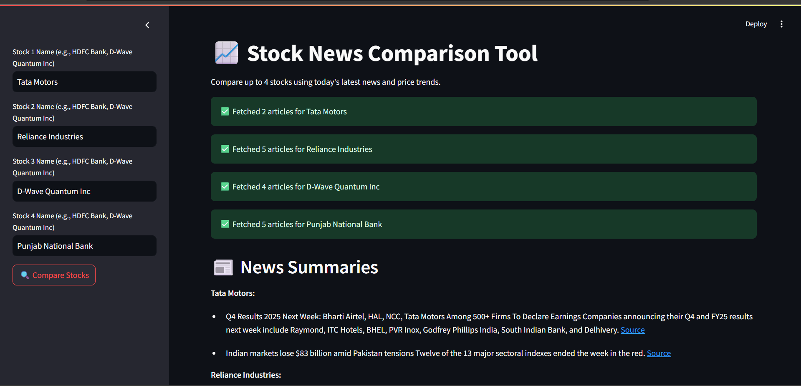

# 📊 Stock News Comparison Tool

A **Streamlit-powered app** to compare up to 4 stocks using the latest news and price trends.  
Get summarized news, price trend graphs, and **actionable investment recommendations** — all in one place!

---

## 🚀 Features

- 🔍 Compare up to **4 stocks side by side**
- 📈 **Automatic ticker detection** via Yahoo Finance
- 📰 Fetches and **summarizes latest news** for each stock
- 📊 Plots **7-day price trends** using Yahoo Finance data
- 💬 **AI-style news sentiment analysis**
- 💡 **Actionable investment recommendations** based on news and trends
- ✅ Handles **missing data gracefully** (no crashes!)

---

## 🖥️ Demo

<!-- Add a screenshot below -->


---

## 🛠️ Installation

**Clone the repository:**

```bash
git clone https://github.com/DINAKAR-S/Stock-Research-Tool.git
cd Stock-Research-Tool
````

**Install dependencies:**

```bash
pip install -r requirements.txt
```

**Set up your API key:**

1. Get a free [NewsData.io](https://newsdata.io/) API key.
2. Create a `.env` file in the project root:

```env
NEWSDATA_API_KEY=your_api_key_here
```

---

## ▶️ Usage

**Start the app:**

```bash
streamlit run main.py
```

**How to use:**

* Enter up to **4 stock/company names** in the sidebar (e.g., `Apple`, `Reliance Industries`, `D-Wave Quantum Inc`).
* Click **"🔍 Compare Stocks"** to view:

  * 📄 Summarized news for each stock
  * 📈 7-day price trend graphs
  * 🧠 News-based conclusions
  * 💡 Clear investment recommendations

---

## 📦 Project Structure

```
.
├── main.py               # Streamlit app
├── utils.py              # Helper functions (news, plotting, summarization, etc.)
├── requirements.txt      # Python dependencies
├── .env                  # Your API key (not committed)
└── README.md             # This file
```

---

## ⚠️ Notes & Troubleshooting

* **Yahoo Finance data issues:**
  If you see "No price data available," Yahoo Finance may be temporarily blocking API access. This is a known issue and **not a bug** in this app.

* **API limits:**
  Free NewsData.io accounts have daily request limits.

* **For best results:**
  Use **well-known company names** (e.g., Apple, Reliance Industries, HDFC Bank) for accurate ticker detection.

---

## 🤝 Contributing

Pull requests are welcome!
If you find a bug or want to suggest a feature, please [open an issue](https://github.com/DINAKAR-S/Stock-Research-Tool/issues).

---

## 📄 License

This project is licensed under the [MIT License](LICENSE).

---

## 🙏 Acknowledgements

* [Streamlit](https://streamlit.io/)
* [yfinance](https://pypi.org/project/yfinance/)
* [NewsData.io](https://newsdata.io/)
* [BeautifulSoup](https://www.crummy.com/software/BeautifulSoup/)

---

**Happy Investing! 🚀**
